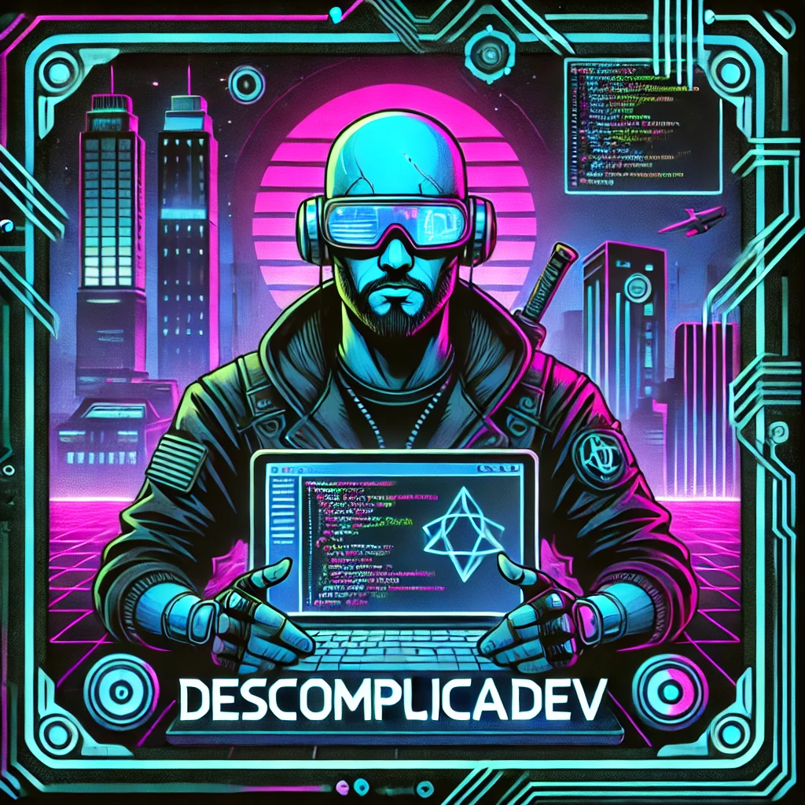

# DescomplicaDev Podcast

Bem-vindo ao repositório do DescomplicaDev, onde o código encontra a simplicidade! Aqui você encontrará todas as informações sobre o nosso podcast focado em programação para iniciantes.

## Roteiro

O roteiro do podcast é gerado via ChatGPT, garantindo um conteúdo claro e direto, ideal para quem está começando na área de programação.

## Áudio

O áudio do podcast é gerado pela ElevenLabs, proporcionando uma narração de alta qualidade.

## Capas

As capas dos episódios são criadas usando o ChatGPT DALL-E, trazendo um visual moderno e atrativo para o nosso podcast.

## Edição

A edição dos áudios e a adição de sons de fundo são feitas com o CapCut, garantindo uma experiência auditiva agradável e envolvente. 

## Ferramentas Utilizadas

- **ChatGPT**: Para geração do roteiro do podcast.
- **ElevenLabs**: Para geração do áudio.
- **ChatGPT DALL-E**: Para criação das capas.
- **CapCut**: Para edição do áudio e adição de sons de fundo.

## Contato

